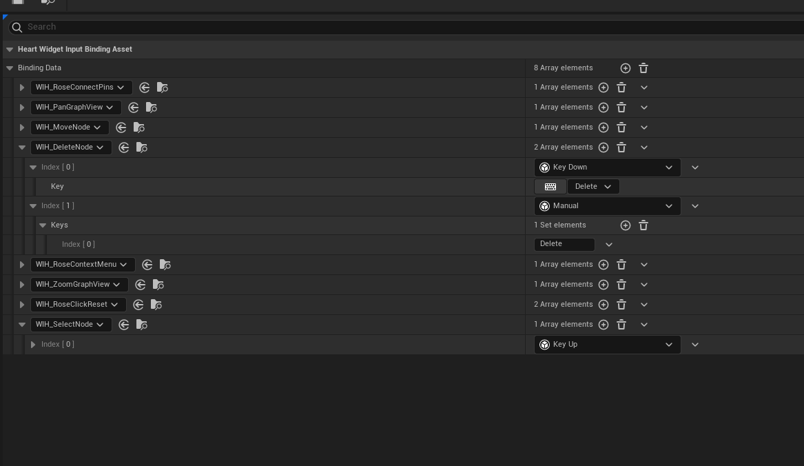

# Input Binding Asset

An Input Binding Asset or (IBA) is where Widget Input Handlers are bound to Triggers that execute them.

They are conceptually identical to Input Mapping Contexts from Enhanced Input.

<figure><figcaption>
An IBA for editing a graph. The delete node has two methods to trigger it: either by pressing the Del key, or by manually executing a context menu button with to the "delete" key.
</figcaption></figure>

Heart Canvas Graphs and Heart Node Palette has the ability to define IBAs to use by default in the Binding Assets field.

<figure><figcaption></figcaption></figure>

At any time IBAs can be added or removed from a widget using the provided Function Library:

<figure><figcaption></figcaption></figure>
